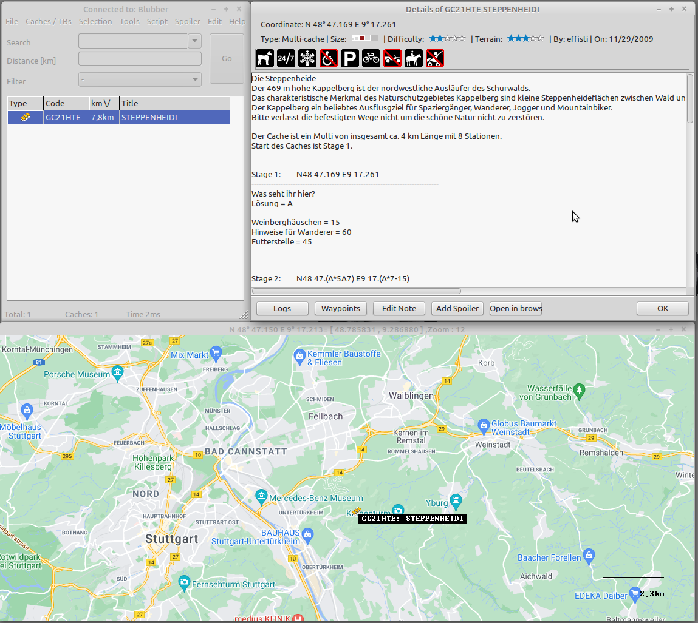

# CCM
This is the public source mirror of the CCM Project.

## Features
 - Windows / Linux 64
 - Bilingual (de / en)
 - Online support
 - Travelbug database
 - Scriptable
 - Custom Filters
 - diverse statistic evaluations (Jasmer / 81 / Attributes ..)
 - automatic updates
 - Export / Import features for GSAK / c:geo
 - as many databases as you want
 - compare / merge databases
 - pocket queries
 - export chaches to garmin GPS
 - import fieldnotes from garmin GPS
 - Online logging
 - customizable
 - rudimentary support for LAB-Caches
 - recordings for light caches (good to download thousands of geocaches arround a route)

## Download
If you just want to use CCM, please download it from: https://www.Corpsman.de

Application:
https://www.corpsman.de/klickcounter.php?url=download/ccm.zip

Setup files:
https://www.corpsman.de/klickcounter.php?url=download/ccmsetup.zip

## Installation instructions

Step by step installation guide (Windows and Linux)

0:43: Linux installation 
1:05: Windows installation 
2:00: setup CCM with the Wizard 

https://www.youtube.com/watch?v=XDlOMkwiAGs

## Tutorials:
 - Working with databases: https://www.youtube.com/watch?v=QlKnDJi_hL8
 - How to handle Trackables: https://www.youtube.com/watch?v=oYHXZXe7-7s
 - Creating Scripts: https://www.youtube.com/watch?v=3Inn9QPoyuw
